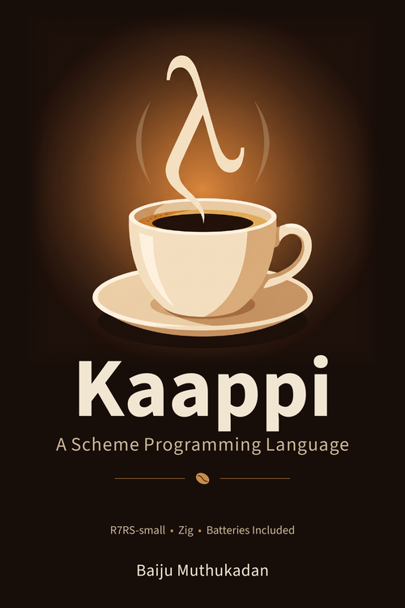

# Kaappi: A Scheme Programming Language

{ width="220" align="right" }

A book teaching the Kaappi Scheme implementation to programmers who already
know Python, JavaScript, or Ruby — no prior Scheme or Lisp experience needed.
18 chapters plus 7 appendices, by Baiju Muthukadan. First Edition, 2026.

## Get the book

| Format | Link |
|--------|------|
| Paperback (Amazon.com) | [Amazon KDP](https://www.amazon.com/dp/B0H7PK7LB5) |
| PDF | [kaappi-book.pdf](https://github.com/kaappi/kaappi-book/releases/latest/download/kaappi-book.pdf) |

Also available on Amazon in other countries:
[UK](https://www.amazon.co.uk/dp/B0H7PK7LB5) &middot;
[Germany](https://www.amazon.de/dp/B0H7PK7LB5) &middot;
[France](https://www.amazon.fr/dp/B0H7PK7LB5) &middot;
[Italy](https://www.amazon.it/dp/B0H7PK7LB5) &middot;
[Spain](https://www.amazon.es/dp/B0H7PK7LB5) &middot;
[Canada](https://www.amazon.ca/dp/B0H7PK7LB5) &middot;
[Australia](https://www.amazon.com.au/dp/B0H7PK7LB5) &middot;
[Japan](https://www.amazon.co.jp/dp/B0H7PK7LB5)

## Chapter outline

| Part | Chapters |
|------|----------|
| I: Getting Started | Introduction, Installation, First Steps |
| II: The Language | Data Types, Lists, Control Flow, Functions, Bindings, Higher-Order Functions, I/O |
| III: Going Further | Macros, Libraries, Records, Error Handling, Continuations |
| IV: Beyond R7RS | Standard Library (SRFIs), FFI, Concurrency |
| Appendices | R7RS Reference, CLI Reference, SRFI Catalog, Error Messages, Ecosystem, Glossary, Further Reading |

Every concept comes with a runnable Kaappi example, and each chapter ends with
exercises. For reference material once you've read the book, see the
[Guide](guide/index.md) and [Procedures](procedures/index.md) sections of
this site.

## Feedback

Found an error or have feedback? Email
[baiju.m.mail@gmail.com](mailto:baiju.m.mail@gmail.com).
